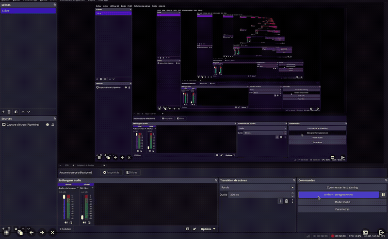
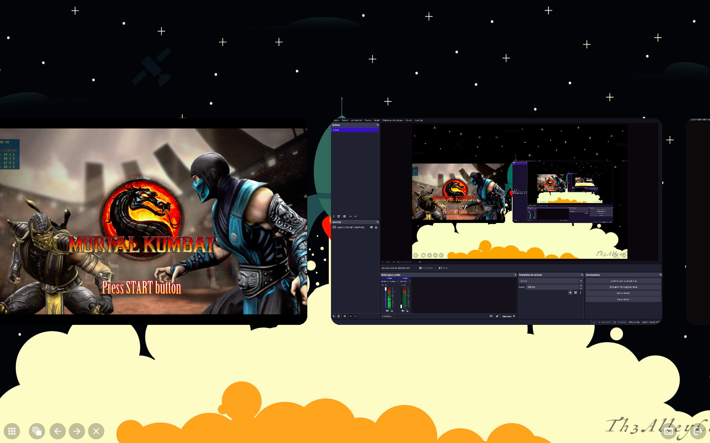
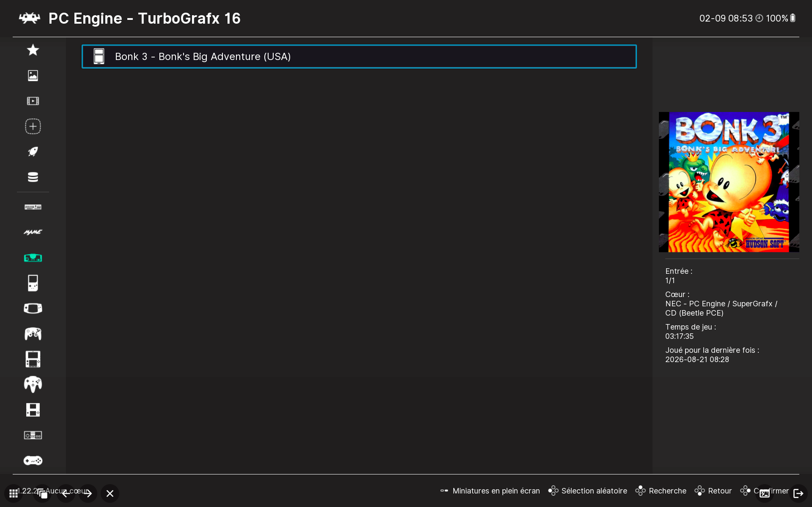
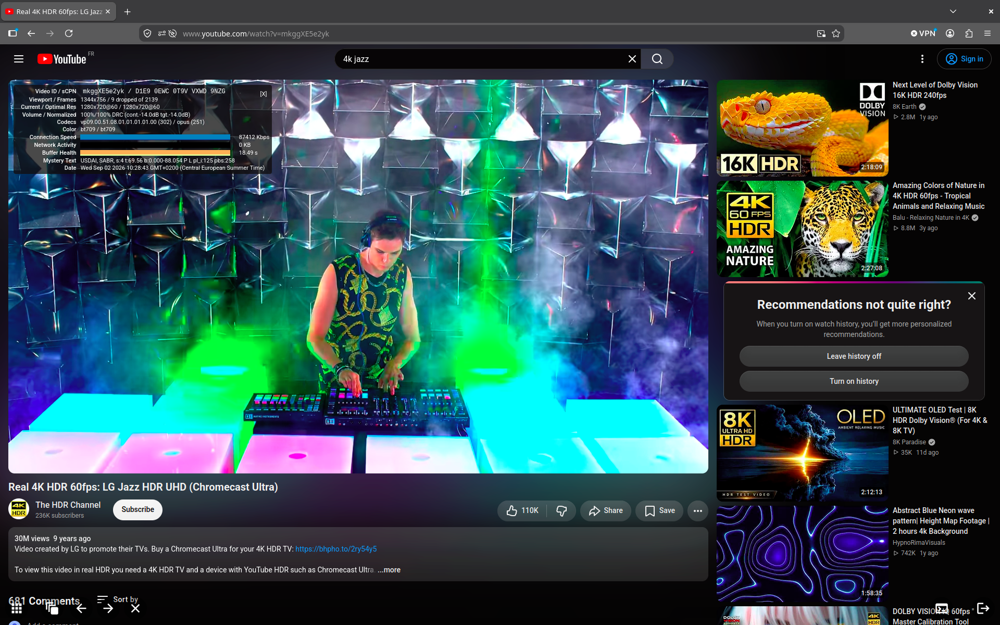
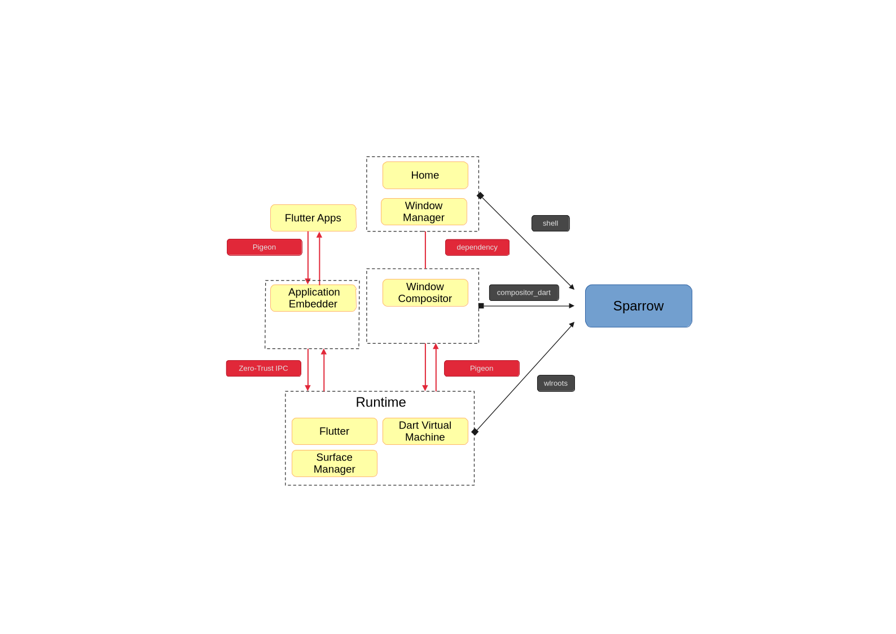

# 🐦 Sparrow

> **Next-Generation Wayland Compositor powered by wlroots and a Flutter Desktop Shell.**

Sparrow is a modern, high-performance Wayland compositor featuring a unique **hybrid architecture**:
- **C++ wlroots Server**: Handles DRM/KMS, EGL/GLES, libinput, DMA-BUF zero-copy buffer sharing, Wayland protocol extensions, and precise damage tracking.
- **Flutter Desktop Shell Client**: Drives the entire user interface, window management animations, touch/trackpad gestures, overview transitions, docks, and desktop widgets with **Flutter Impeller / GLES 3.2**.

---

## 📸 Showcase




| Desktop Overview | Gaming | Damage Debugger & FPS OSD | Web |
| :---: | :---: | :---: | :---: |
|  |  |  |  |  |

---

## ⚡ Key Features

- **🚀 Zero-Copy DMA-BUF Hardware Rendering**:
  Wayland client surfaces (games, video players, browsers) are directly imported as hardware textures into the compositor pipeline with zero CPU memory copies.
- **⚡ Zero-Copy `udmabuf` Acceleration for `wl_shm`**:
  Automatically converts CPU-rendered shared memory buffers (`wl_shm` from Qt apps, software-rendered tools) into hardware DMA-BUFs via Linux `/dev/udmabuf`, eliminating costly CPU-to-GPU PCIe uploads (`glTexSubImage2D`) and cutting CPU usage by up to ~70%.
  see ([Making wl_shm fast](https://zamundaaa.github.io/wayland/2026/05/06/making-wl-shm-fast.html))
- **⏱️ Soft-Realtime Compositor Scheduling (`SCHED_RR`)**:
  Runs the compositor rendering and VSync pipeline with soft-realtime round-robin priority (`SCHED_RR`, priority 20). Uses `SCHED_RESET_ON_FORK` so spawned user processes (games, terminals, apps) automatically run with standard scheduling, guaranteeing microsecond preemption and jitter-free frame pacing even under heavy CPU compile/gaming loads.
- **🧵 Flutter Isolates (`IsolateNameServer`) & Thread-Safe Wayland Dispatcher**:
  Full support for background Flutter isolates (`Isolate.spawn()`) with cross-isolate port registry via `flutter/isolate`. Features a lock-free/low-latency kernel `eventfd` dispatcher (`sparrow_dispatch_to_wayland`) allowing background worker isolates (D-Bus authentication, virtualization, heavy system tasks) to safely manipulate Wayland/wlroots state without locking or stalling the 60/144Hz compositor UI loop.
- **🛡️ Triple Buffering & Late-Latching (Mailbox Mode)**:
  Hardware DRM/GBM swapchain with 3+ buffer rotation combined with a 3-frame historical damage ring (`NUM_DAMAGE_HISTORY 3`). Eliminates VSync backpressure stalls and micro-stuttering under high GPU/CPU load while Late-Latching guarantees that games and video surfaces always sample the freshest available committed frame with minimal input latency.
- **🎯 Precise Damage Tracking & Damage History**:
  Maintains a 4-frame damage ring buffer. Only regions that actually change on screen are redrawn and swapped, reducing GPU and power consumption to minimum.
- **🖥️ XWayland-satellite Support**:
  Transparent execution and management of legacy X11 applications alongside native Wayland clients.
- **🕊️ Strongly-Typed Pigeon Embedder IPC**:
  All communications between the C++ wlroots server and Flutter are generated via Flutter **Pigeon**.
- **✨ Fluid UI & Flutter Ecosystem**:
  Leverages the full expressive power of Flutter (custom shaders, smooth spring animations, rich widget library, vector graphics).
- **🔍 Smooth Full-Desktop Zoom**:
  Butter-smooth desktop screen magnifier.
- **🛠️ Built-in Real-Time Diagnostics & Profiling**:
  - **FPS & Frame Latency OSD** (`F11` / `--fps`): Real sliding-window client commit measurement and render frame latency.
  - **Surface Tree Inspector** (`F10` / `--inspect`): Instant colorized ASCII dump of all active outputs, toplevels, subsurfaces, and popups.
  - **Live Damage Rainbow Visualizer** (`F12` / `--debug-damage`): Real-time colored borders outlining redrawn damage rectangles.
  - **GPU Debug Markers & Profiling** (`-G` / `--trace-gpu`): Nested `glPushDebugGroup` scopes for **RenderDoc**, NVIDIA Nsight, and Mali Graphics Debugger.
  - **Perfetto & Ftrace CPU Tracing** (`--trace`): Direct kernel `trace_marker` integration for system-wide timeline profiling on [ui.perfetto.dev](https://ui.perfetto.dev).

---

## 🏗️ Architecture

Sparrow bridges the low-level Linux graphics stack with the Flutter reactive UI engine:



---

## 🛠️ Building Sparrow

### Prerequisites
Make sure you have the required development libraries installed:
- `clang` / `clang++` (C++26 support)
- `meson` & `ninja`
- `wayland-protocols`, `libwayland(devel)`
- `libdrm(devel)`, `libinput(devel)`, `libxkbcommon(devel)`, `libpixman(devel)`
- `libegl(devel)`, `libgles2(devel)`, `libgbm(devel)`, `libdisplay-info(devel)`
- `vulkan(devel)` / `vulkan-headers` / `libvulkan(devel)` (for Vulkan Wayland runner & Impeller backend)
- Flutter SDK (on `PATH`)

- `wlrctl`, `vkcube` and one of the following terminal emulators may be required during the build process:
  - `alacritty` 
  - `foot` 
  - `kitty` 
  - `weston-terminal` 
  - `xterm`


### Build Commands
Use the universal `./build.sh` script to build the project:

```bash
# 1. Full Release Build (PGO + LTO + Impeller + DMA-BUF)
./build.sh

# 2. Fast C++ Server Rebuild (~8-10 seconds)
./build.sh server

# 3. Flutter Shell Client Rebuild
./build.sh client

# 4. Profile Build (Enables Dart VM Service & DevTools inspection)
./build.sh profile --host-path=flutter/engine/host_profile

# 5. Debug Build with Debug Symbols
./build.sh debug server

# 6. Sanitizer Builds for Safety & Bug Hunting
./build.sh asan        # AddressSanitizer
./build.sh ubsan       # UndefinedBehaviorSanitizer
./build.sh tsan        # ThreadSanitizer
./build.sh valgrind    # Valgrind memory detector

# 7. Regenerate Pigeon C++ and Dart message bindings
./build.sh pigeon

# 8. Clean build artifacts
./build.sh clean
```

For all build options, run `./build.sh -h`.

---

## 🔬 Compilation Modes & Flutter Engine Setup

Sparrow embeds the Flutter Engine in **AOT (Ahead-of-Time)** mode for maximum performance and low latency. Depending on your workflow, you can build Sparrow in **Release** or **Profile** mode:

```
                      ┌───────────────────────────────────────────────┐
                      │             Choose Build Workflow             │
                      └───────┬───────────────────────────────┬───────┘
                              │                               │
                Release Mode  ▼                 Profile Mode  ▼
         ┌───────────────────────────┐         ┌───────────────────────────┐
         │ 1. Compile Release Engine │         │ 1. Compile Profile Engine │
         │    ./build_engine.sh      │         │    ./build_engine.sh      │
         │         release           │         │         profile           │
         └─────────────┬─────────────┘         └─────────────┬─────────────┘
                       ▼                                     ▼
         ┌───────────────────────────┐         ┌───────────────────────────┐
         │ 2. Build Sparrow Release  │         │ 2. Build Sparrow Profile  │
         │    ./build.sh release     │         │    ./build.sh profile     │
         │ (or --host-path=...)      │         │ --host-path=host_profile  │
         └─────────────┬─────────────┘         └─────────────┬─────────────┘
                       ▼                                     ▼
         ┌───────────────────────────┐         ┌───────────────────────────┐
         │ 3. Run High-Performance   │         │ 3. Run & Attach DevTools  │
         │    ./out/sparrow          │         │ ./out/sparrow --vm-service│
         │  (Stripped AOT Product)   │         │  flutter attach (Port 8181)│
         └───────────────────────────┘         └───────────────────────────┘
```

### 1. Release Mode (Production & Maximum Performance)
In release mode, Sparrow compiles the Flutter Shell with `-Ddart.vm.product=true` for maximum CPU/GPU efficiency, stripping debugging overhead:
- **Prerequisite**: Ensure a release `libflutter_engine.so` is installed in your system (`~/.local/lib64/` or `/usr/lib64/`), or built locally via `./build_engine.sh release`.
- **Build**:
  ```bash
  # Using system-installed engine:
  ./build.sh release

  # Or using a custom local engine:
  ./build.sh release --host-path=flutter/engine/host_release
  ```

---

*(NOTE: It's recommended to copy the generated artifacts to `[sparrow_src_dir]/flutter/engine/host_release/`)*

### 2. Profile Mode & Flutter DevTools (Dart VM Service & Profiling)
In profile mode, Sparrow compiles the Flutter Shell in AOT with `-Ddart.vm.profile=true` and starts the **Dart VM Service** (WebSocket JSON-RPC server) on port `8181`. This enables live widget inspection, memory heap analysis, frame rendering timeline, and CPU profiling via Flutter DevTools.

#### Step 1: Compile the Flutter Engine in Profile Mode
Because pre-built public embedder binaries from Google exclude the VM service, you must build the engine once in profile mode:
```bash
./build_engine.sh profile
```
*(NOTE: It's recommended to copy the generated artifacts to `[sparrow_src_dir]/flutter/engine/host_profile/`)*

#### Step 2: Build Sparrow in Profile Mode
Compile Sparrow pointing to the profile engine artifacts:
```bash
./build.sh profile --host-path=flutter/engine/host_profile
```

#### Step 3: Run Sparrow with Dart VM Service
Launch the compositor with the `--vm-service` flag:
```bash
./out/sparrow --vm-service
```
*(Log output will show: `[flutter] The Dart VM service is listening on http://127.0.0.1:8181/`)*

#### Step 4: Connect Flutter DevTools
In a separate terminal, attach DevTools to the running compositor:
```bash
cd shell
flutter attach --debug-uri=http://127.0.0.1:8181/
```
Or open `http://127.0.0.1:8181/` directly in your browser to inspect widget trees, monitor memory allocations, and analyze Impeller frame render times.

---

## 🤖 Automated UI Testing, PGO Pipeline & CI/CD

Sparrow includes an automated synthetic UI test bot, an automated 3-stage Profile-Guided Optimization (PGO) pipeline, and full Headless / Docker CI integration:

### 1. Automated Test Runner (`sparrow_bot.sh`)
Injects synthetic pointer, touch, and keyboard interactions using `wlrctl`, launches test Wayland client windows (`weston-terminal`), and verifies clean compositor startup and shutdown:
```bash
# Run a standard 5-second regression test:
./tools/bot/sparrow_bot.sh --duration=5

# Run in background Headless mode (no display/window needed):
./tools/bot/sparrow_bot.sh --headless --duration=5
```

### 2. Automated 3-Stage PGO Pipeline (`pgo_optimize.sh`)
Profiles realistic compositor execution scenarios and generates an ultra-optimized native binary:
```bash
# Interactive PGO compilation (displays live test execution):
./tools/bot/pgo_optimize.sh

# Headless PGO compilation (ideal for background compilation or CI/CD runners):
./tools/bot/pgo_optimize.sh --headless
```

### 3. Docker Container & Continuous Integration
Run the entire build and automated test suite inside a self-contained container:
```bash
# Build the Docker CI image:
docker build -t sparrow-ci .

# Execute full build and automated headless regression test bot:
docker run --rm sparrow-ci
```

*(Sparrow also includes an automated GitHub Actions CI workflow in `.github/workflows/ci.yml`)*

---

## 🚀 Running Sparrow

Run the compiled executable located in `./out/sparrow`:

```bash
# Standard Launch
./out/sparrow

# Launch with Real-Time FPS & Frame Latency OSD
./out/sparrow -F

# Launch with Wayland Protocol Tracing & Verbose Logs
./out/sparrow -P -v

# Launch with GPU Debug Markers (RenderDoc / Nsight)
./out/sparrow -G

# Launch with Damage Debug Visualizer
./out/sparrow -D
```

---

## ⌨️ Runtime configuration, Hotkeys & CLI Options

### INI configuration file
Sparrow uses an INI file for runtime configuration. The file is located at `~/.config/sparrow/sparrow.ini`.

```ini
[Theme]
wallpaper = [PATH_TO_YOUR_IMAGE] (ex. /home/username/Pictures/image.png)

[Commands]
launcher = [YOUR_LAUNCHER_APPLICATION]
terminal = [YOUR_TERMINAL_APPLICATION] (ex. alacritty or foot or kitty or weston-terminal or xterm)
logout = [YOUR_LOGOUT_APPLICATION] (ex. wayland-logout)
```

**NOTE**: Due to the fact that Sparrow does not yet support the layer-shell protocol, the `launcher` must not be set to an application that requires layer-shell to be able to run.

### Interactive Hotkeys
| Hotkey | Feature | Description |
| :---: | :--- | :--- |
| **`Ctrl` + `Alt` + `Suppr`** | **Logout** | Launches the logout command defined in `sparrow.ini` (see `[Commands].logout` field). |
| **`Super`** | **Application Launcher** | Launches the application launcher defined in `sparrow.ini` (see `[Commands].launcher` field). |
| **`Alt Left`** | **Overview Mode** | Toggles show/hide overview of all running applications in a carousel-like view. |
| **`Super` + `Q`** | **Quit Application** | Closes the focused window or application. |
| **`Super` + `Enter`** | **Terminal Launcher** | Launches the terminal emulator defined in `sparrow.ini` (see `[Commands].terminal` field). |
| **`Super` + `Scroll`** | **Desktop Zoom In / Out** | Continuous screen zoom centered smoothly on the cursor. |
| **`Super` + `+/-`** | **Desktop Zoom Step** | Increments or decrements the screen magnification level. |
| **`Super` + `0`** | **Reset Desktop Zoom** | Smoothly resets desktop magnification back to 1.0x (100%). |
| **`Ctrl` + `Left/Right`** | **Navigation** | Moves selection to the next/previous application in the list. |
| **`Left/Right`** | **Navigation (overview mode only)** | Moves selection to the next/previous application in the list. |
| **`Space` or `Enter` or `Alt Left`** | **Navigation (overview mode only)** | Close the overview mode. and select the current focused view. |
| **`F6`** | **Perfetto Trace Toggle** | Toggles on/off the in-process Perfetto trace recording to `out/sparrow.pftrace`. |
| **`F7`** | **RenderDoc Frame Capture** | Triggers an immediate frame capture via the RenderDoc in-application API (`renderdoc_app.h`). |
| **`F8`** | **DPMS Power Toggle** | Toggles the monitor power state (ON/OFF) for the primary display. This is useful for testing sleep/resume behavior and power management capabilities. |
| **`F9`** | **Buffering Mode Switcher** | Cycles through `Double Buffering (DB)` ➔ `Dynamic Triple Buffering (AUTO)` ➔ `Forced Triple Buffering (TB:ON)`. |
| **`F10`** | **Surface Tree Inspector** | Dumps the complete hierarchy (Outputs, Views, Subsurfaces, Popups, PIDs, formats) into the terminal. |
| **`F11`** | **FPS & Latency Monitor** | Toggles the real-time on-screen display (OSD) in the top-right corner. |
| **`F12`** | **Damage Visualizer** | Toggles rainbow colored bounding boxes around redrawn screen regions. |

### Command Line Options
| Flag | Short | Environment Variable | Description |
| :--- | :---: | :--- | :--- |
| `--trace-perfetto[=file]` | | `SPARROW_TRACE_PERFETTO=file` | Starts in-process Perfetto trace recording (default: `out/sparrow.pftrace`) |
| `--renderdoc-capture[=N]` | | `RENDERDOC_CAPFILE=path` | Triggers RenderDoc frame capture at frame N (or on F7) |
| `--triple-buffer` | `-3` | `SPARROW_BUFFERING=triple` | Forces Triple Buffering for maximum gaming throughput |
| `--auto-buffer` | | `SPARROW_BUFFERING=auto` | Enables Dynamic Triple Buffering (adapts to GPU load) |
| `--double-buffer` | `-2` | `SPARROW_BUFFERING=double` | Uses Double Buffering for minimum input latency (default) |
| `--buffering=<mode>` | | `SPARROW_BUFFERING=<mode>` | Select buffering mode: `double`, `auto`, or `triple` |
| `--fps` | `-F` | `SPARROW_SHOW_FPS=1` | Enables FPS and frame latency OSD at startup |
| `--debug-damage` | `-D` | `SPARROW_DEBUG_DAMAGE=1` | Enables damage rectangle visualization at startup |
| `--debug-protocol` | `-P` | `SPARROW_DEBUG_PROTOCOL=1` | Enables detailed Wayland protocol logging |
| `--trace-gpu` | `-G` | `SPARROW_TRACE_GPU=1` | Enables OpenGL/EGL debug groups and texture labels for RenderDoc |
| `--trace` | | `SPARROW_TRACE=1` | Enables Perfetto / Ftrace `trace_marker` kernel logging |
| `--inspect` | `-I` | `SPARROW_INSPECT=1` | Dumps surface tree at startup |
| `--verbose` | `-v` | `SPARROW_DEBUG=1` | Enables verbose wlroots debug logging |
| `--no-realtime` | `-n` | `SPARROW_NO_REALTIME=1` | Disables soft-realtime features |
| `--vm-service[=port]` | | `SPARROW_VM_SERVICE=8181` | Enables Dart VM Service / DevTools / Flutter Driver (default: 8181) |

---

## 🔬 GPU & Performance Tracing (Perfetto & RenderDoc)

Sparrow includes an in-process, privilege-free profiling system using **Google Perfetto** and **RenderDoc**:
- **Zero Overhead in Release**: All tracing logic is guarded by `#if defined(SPARROW_ENABLE_TRACE)`. In standard release builds (`./build.sh release`), tracing is completely compiled out with zero runtime overhead, zero binary bloat, and zero symbols.
- **In-Process Tracing**: Does **not** require `sudo`, root privileges, or external kernel daemon setup.
- **Visual Analysis**: Directly compatible with [https://ui.perfetto.dev](https://ui.perfetto.dev).

### 1. Building with Tracing Enabled
```bash
./build.sh trace server
```

### 2. Automated Profiling Harness
Run an automated profiling session with synthetic workloads and validation:
```bash
# Profile for 5 seconds and generate out/sparrow_profile.pftrace
./tools/bot/profile_gpu.sh --duration=5

# Headless mode (e.g. on CI / server without monitor)
./tools/bot/profile_gpu.sh --duration=5 --headless

# With custom Flutter app bundle
./tools/bot/profile_gpu.sh --duration=10 --app=out/demo_app
```

### 3. Interactive Tracing & RenderDoc Capture
```bash
# Start Sparrow with Perfetto trace enabled
./out/sparrow --trace-perfetto=out/sparrow.pftrace

# While running:
# - Press F6: Toggle Perfetto trace recording
# - Press F7: Trigger an immediate RenderDoc frame capture
```

### 4. Viewing Traces
1. Open **[https://ui.perfetto.dev](https://ui.perfetto.dev)** in Google Chrome or Chromium.
2. Drag and drop `out/sparrow_profile.pftrace` into the browser window.
3. Inspect tracks:
   - `gpu`: Buffer imports, texture allocations, DMA-BUF bindings.
   - `compositor`: Output render passes, VBlank commits, XDG commits.
   - `render`: Flutter backing store allocation and layer presentation.
   - `ipc`: JSON-RPC client requests and broadcasts.

---

## 🛡️ Sanitizers & Memory Safety Testing

Sparrow includes native build modes and configurations for Sanitizers to validate memory safety, thread concurrency, and prevent regressions:

### 1. AddressSanitizer & LeakSanitizer (ASan / LSan)
Detects buffer overflows, use-after-free, and memory leaks on shutdown (utilizes `lsan_suppressions.txt` to suppress external uninstrumented driver leaks):
```bash
./build.sh asan server
LSAN_OPTIONS="suppressions=lsan_suppressions.txt" ASAN_OPTIONS="symbolize=1:detect_leaks=1:abort_on_error=0:allocator_may_return_null=1:fast_unwind_on_malloc=1" ./out/sparrow &> sparrow-asan.log
```

### 2. UndefinedBehaviorSanitizer (UBSan)
Detects integer overflows, alignment issues, and null dereferences (utilizes `ubsan_suppressions.txt`):
```bash
./build.sh ubsan server
UBSAN_OPTIONS="print_stacktrace=1:halt_on_error=0:report_error_type=1:symbolize=1:suppressions=ubsan_suppressions.txt" ./out/sparrow &> sparrow-ubsan.log
```

### 3. ThreadSanitizer (TSan)
Detects data races between Wayland event dispatching and Flutter rasterizer threads (utilizes `tsan_suppressions.txt` to filter uninstrumented GPU driver background compiler threads):
```bash
./build.sh tsan server
TSAN_OPTIONS="report_signal_unsafe=0:symbolize=1:history_size=7:suppressions=tsan_suppressions.txt" ./out/sparrow &> sparrow-tsan.log
```

---

## 🗺️ Next Steps & Roadmap
- **`Multi-Monitor Support`**: Dynamic display attachment and per-output scale configurations (including refresh rates).
- **`ARM64/AArch64 Support`**: allow sparrow to run on ARM64 (obviously Armel will not be supported...).
- **`Vulkan Support`**: add support for Vulkan backend to Flutter.
- **`Software Rendering`**: add support for software rendering to Flutter.
- **`Simple Tiling`**: add support for a very basic tiling layout (up to 2 applications).
- **`GPU Reset`**: add support for GPU reset.
- **`wlr_layer_shell_v1 (partial support)`**: Integration of background, toplevel, and overlay layer are scheduled (some features like exclusive zones might not be supported, in the near future, or not at all...).
- **`animated screen rotation`**: add smooth, animate screen rotation based on accelerometer/gyroscope.
- **`virtual keyboard`**: show up a virtual keyboard when the focus is on a text input field of an application in tablet mode. 


---

## 📄 License
This project is licensed under the GPL3 License. See [LICENSE](LICENSE) for details.

---

## 🙏 Acknowledgments & Inspirations

Sparrow is an independent Wayland compositor built with Flutter and wlroots. It draws architectural insights, design patterns, and inspiration from several open-source projects:

- **[flutter_wlroots](https://github.com/FlutterWayland/flutter_wlroots)**: Initial proof-of-concept inspiration; foundational Dart bindings in `compositor_dart` were derived from this work ([License](doc/LICENSE_FLUTTER_WLROOTS)).
- **[Zenith](https://github.com/roscale/zenith)**: Architectural inspiration for Flutter desktop shell and compositor integration ([License](doc/LICENSE_ZENITH)).
- **[Wayfire](https://github.com/WayfireWM/wayfire)**: Compositor design patterns and C++ wlroots wrapping headers (`src/api/sparrow/nonstd/wlroots*.hpp`).
- **[flutter-elinux](https://github.com/sony/flutter-elinux) & [ivi-homescreen](https://github.com/toyota-connected/ivi-homescreen)**: engine & Wayland integration approaches.
- **[wlroots](https://gitlab.freedesktop.org/wlroots/wlroots)**: Pluggable, composable Wayland compositor library powering the low-level compositor core.
- **[niri](https://github.com/niri-wm/niri)**: Wayland compositor architectural inspiration.
- **[Weston](https://gitlab.freedesktop.org/wayland/weston)**: Wayland reference implementation.
- **[Sway](https://github.com/swaywm/sway)**: Wlroots reference implementation.

- **[Android](https://source.android.com/) & [Chrome OS](https://opensource.google/projects/chromiumos)**: main inspiration...

---

## 📞 contact

arm-cade@proton.me